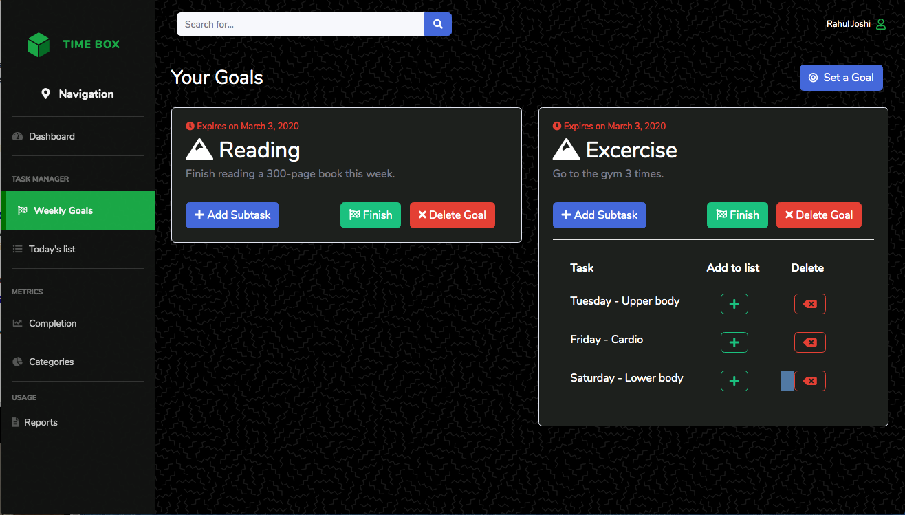
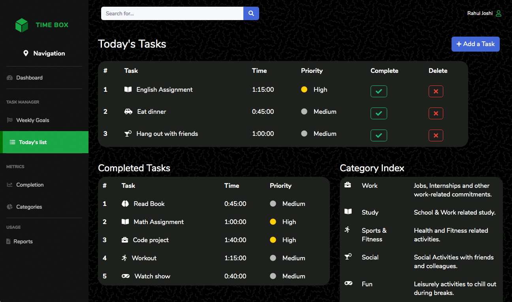
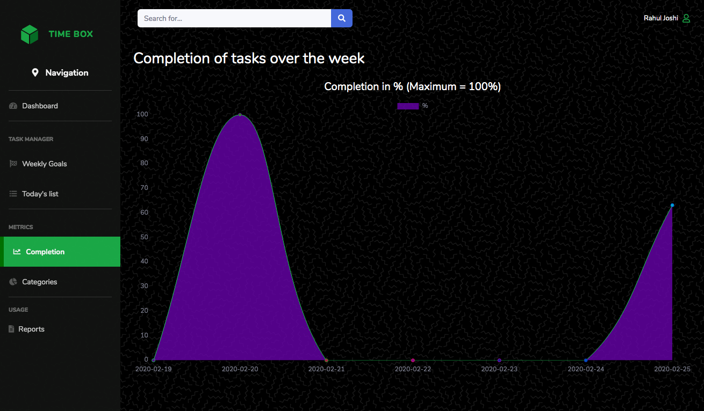
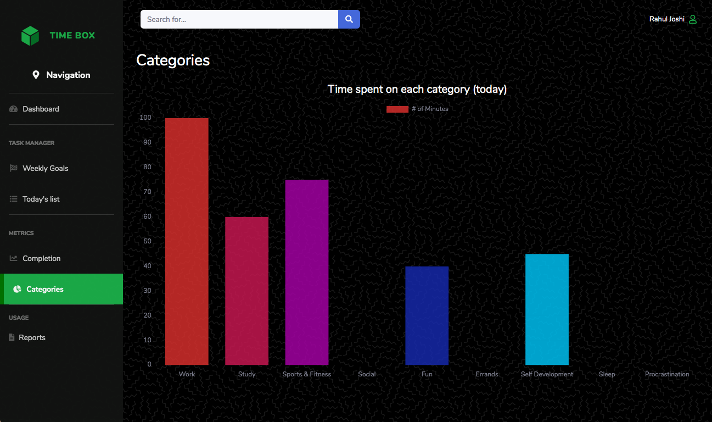
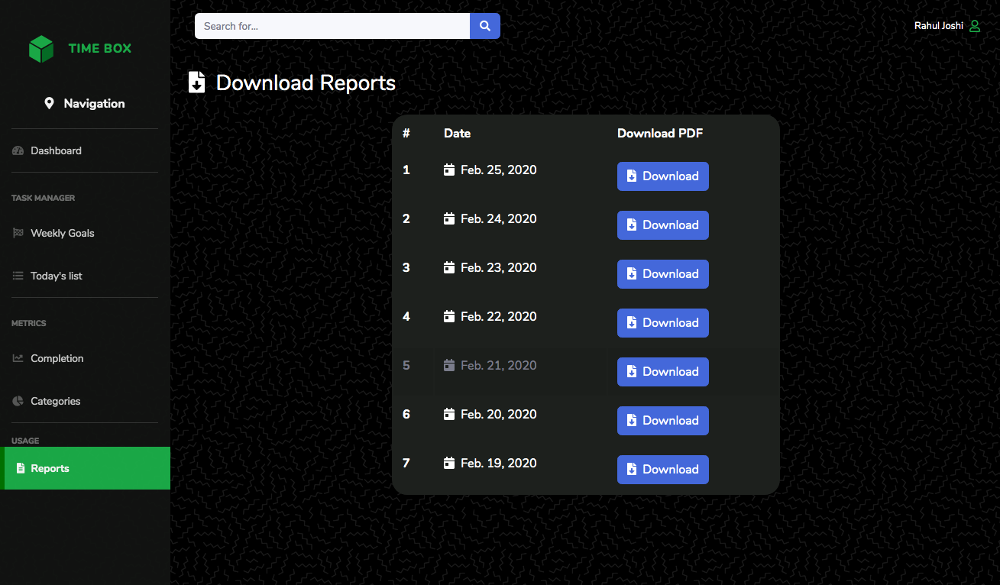

# TimeBox
  

## What can TimeBox do?

### Set weekly goals
Use TimeBox to set your goals for the week. You can even add subtasks within goals to keep track of your progess.

  

### Manage daily tasks
Create and manage a list of tasks to complete in the day. Categorise the tasks by type and priority and decide how much time you'll spend on each of them.

  

### Completed tasks
See what percentage of tasks you completed over the last week.

  

### Time spent on each category
View where you spent your time the current day, and even the last 7 days.

  
  

### Download Reports
Download reports about your tasks to store and review whenever you want!

  

